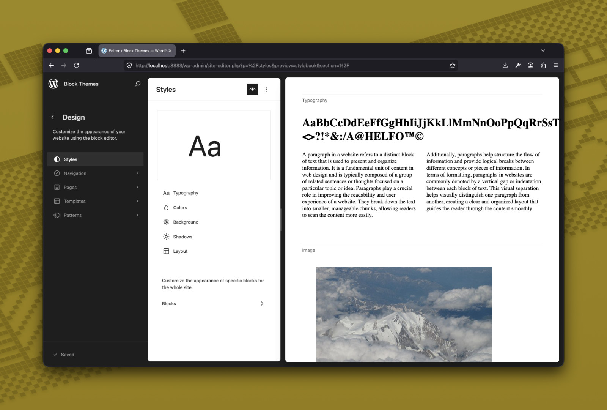
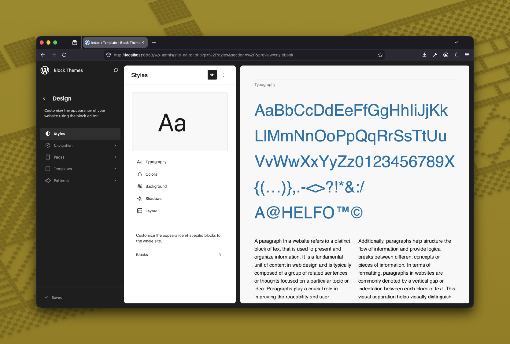
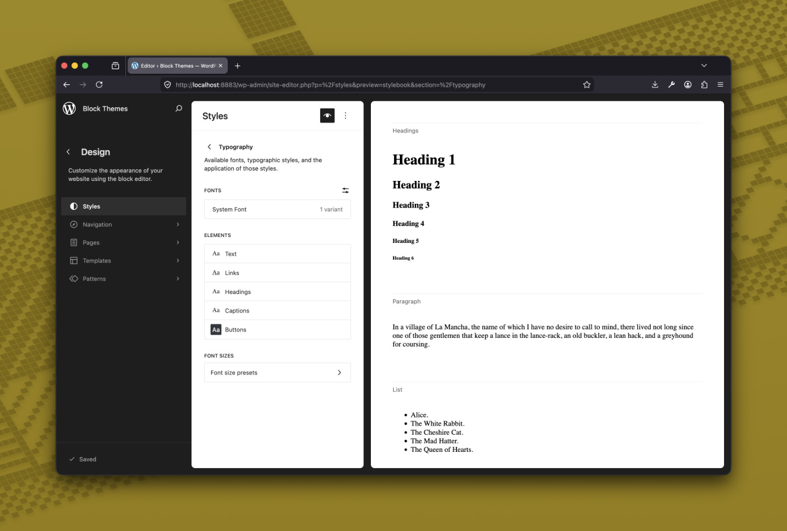
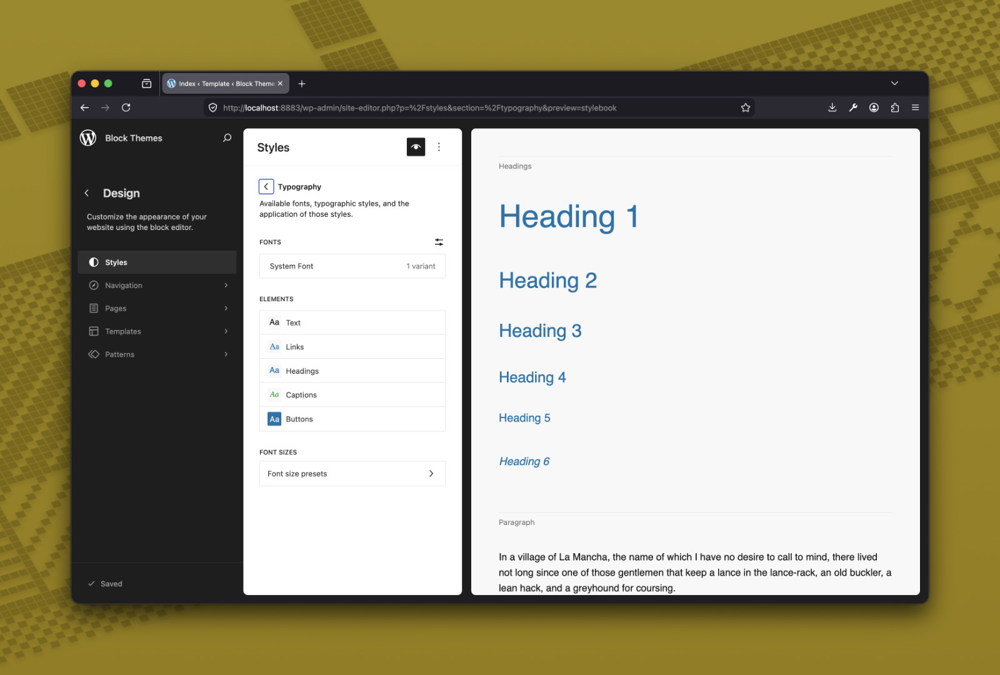
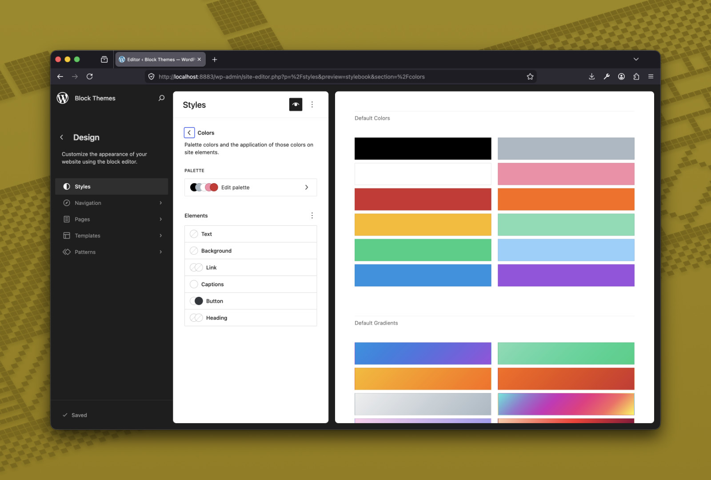
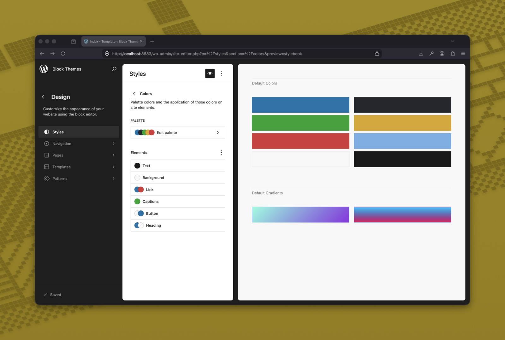
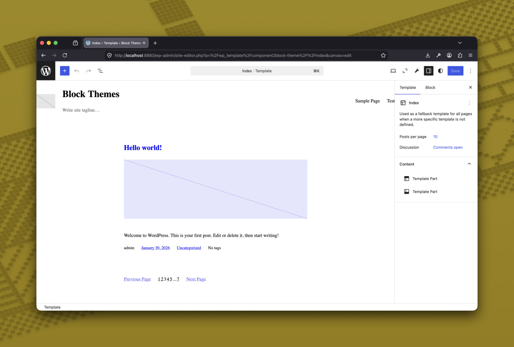
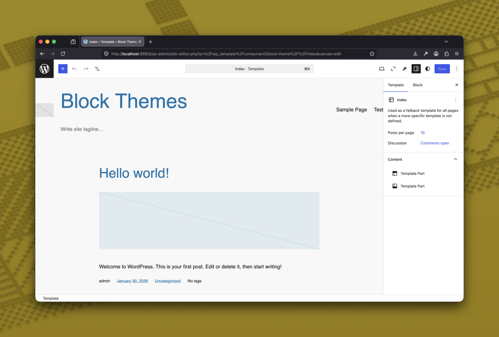

# component2block

A design token generator for Storybook component libraries that target WordPress block themes. Define your tokens once in a single JSON config, and component2block generates everything both platforms need — CSS variables, `@font-face` declarations, base typography, WordPress `theme.json`, and PHP integration hooks.

## The Problem

Building a component library that works in both Storybook/React and WordPress means maintaining design tokens in multiple formats. Colors, spacing, fonts, and typography settings need to exist as CSS custom properties for your components, as `theme.json` presets for the WordPress Site Editor, and as PHP hooks to wire it all together. Keeping these in sync manually is tedious and error-prone.

## How It Works

You write one config file. The generator produces everything.

```
c2b.config.json                                single source of truth
    │
    │   npx c2b generate
    │
    ├──► src/styles/tokens.css                 CSS custom properties
    ├──► src/styles/fonts.css                  @font-face declarations
    ├──► src/styles/_content-generated.scss    Base typography (zero-specificity)
    │
    ├──► dist/wp/theme.json                    WordPress settings + styles
    ├──► dist/wp/tokens.wp.css                 CSS vars mapped to --wp--preset--*
    ├──► dist/wp/tokens.css                    CSS vars with hardcoded values
    └──► dist/wp/integrate.php                 PHP hooks for the theme.json cascade
```

Your components always reference `--prefix--*` CSS variables. In Storybook, those resolve to hardcoded values. In WordPress, they can optionally map to `--wp--preset--*` variables so themes can override them via the Site Editor.

## Key Concepts

- **Single source of truth** — One config drives all outputs. Change a color once, it updates everywhere.
- **12 token categories** — Colors, gradients, spacing, font families, font sizes, shadows, layout, font weights, line heights, border radii, transitions, and z-index.
- **Locked vs themeable** — By default, tokens are hardcoded (locked). Set `output.wpThemeable: true` to let WordPress themes override them.
- **Zero-specificity base styles** — Generated SCSS uses `:where()` selectors so component BEM classes always win over base typography.
- **Storybook preset** — Auto-injects all generated styles into Storybook. No manual imports.
- **WordPress default layer** — The generated `theme.json` injects at the lowest priority layer, so any theme can override it.

## Quick Example

```json
{
  "prefix": "mylib",
  "tokens": {
    "color": {
      "primary": "#0073aa",
      "primary-hover": { "value": "#005a87", "cssOnly": true }
    },
    "fontSize": {
      "small": { "min": "0.875rem", "max": "1rem" }
    }
  }
}
```

```bash
npx c2b generate
```

Then in your components:

```scss
.mylib-card {
  color: var(--mylib--color-primary);
  font-size: var(--mylib--font-size-small);
}
```

## CLI

```
npx c2b generate [options]

Options:
  --config <path>   Path to config file (default: ./c2b.config.json)
  --dry-run         Output to stdout instead of writing files
```

## Programmatic API

```ts
import { generate } from 'component2block';

const result = generate('./c2b.config.json');
// result.files: Array<{ path: string; size: number }>
```

Individual generators are also exported:

```ts
import {
  loadConfig,
  generateTokensCss,
  generateTokensWpCss,
  generateThemeJson,
  generateFontsCss,
  generateContentScss,
  generateIntegratePhp,
} from 'component2block';
```

## Documentation

[Getting Started](./docs/README.md) — Install, configure, and generate

### Configuration Reference

| Guide | Description |
|-------|-------------|
| [Overview](./docs/config/README.md) | Global fields, token categories, generated files, and full example |
| [Colors & Gradients](./docs/config/colors.md) | Color palette, gradients, cssOnly tokens, and locked vs themeable mode |
| [Spacing](./docs/config/spacing.md) | Spacing scale, WordPress slug conventions, and responsive values |
| [Shadows](./docs/config/shadow.md) | Box shadows, preset vs custom behavior, and Site Editor integration |
| [Fonts](./docs/config/fonts.md) | Static fonts, variable fonts, Google Fonts, and file placement |
| [Base Styles](./docs/config/base-styles.md) | Elements, typography, colors, spacing, and `:where()` selectors |

### Guides

| Guide | Description |
|-------|-------------|
| [Tokens](./docs/guides/tokens.md) | Token syntax, categories, fluid fonts, CSS output |
| [Markup Patterns](./docs/guides/markup.md) | Layout classes for Storybook and WordPress |
| [Storybook Preset](./docs/guides/storybook-preset.md) | Auto-injecting generated styles into Storybook |
| [CLI & Build](./docs/guides/cli-and-build.md) | CLI commands, build scripts, and publishing setup |

### WordPress

| Guide | Description |
|-------|-------------|
| [Integration](./docs/wordpress/integration.md) | Adding compiled assets to a WordPress block theme |
| [Theming](./docs/wordpress/theming.md) | Locked vs themeable mode, overrides, style variations |
| [Blocks](./docs/wordpress/blocks.md) | Block plugin setup and component registration |
| [Editor Styles](./docs/wordpress/editor-styles.md) | Loading styles inside the block editor iframe |
| [theme.json Reference](./docs/wordpress/theme-json-reference.md) | Full settings and styles structure |

### Advanced

| Guide | Description |
|-------|-------------|
| [Architecture](./docs/advanced/architecture.md) | Design decisions, project structure, category registry |
| [Token Flow](./docs/advanced/token-flow.md) | How tokens resolve differently per output |

## Development

```bash
npm install
npm run build    # Compile TypeScript
npm test         # Run 191 tests
```

## Screenshots

| Before | After |
|-------|-------------|
|  |  |
|  |  |
|  |  |
|  |  |
